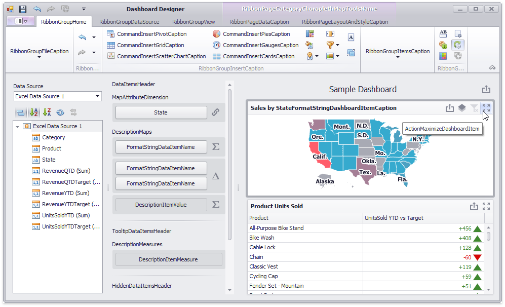

<!-- default badges list -->

<!-- default badges end -->

# Dashboard for WinForms - Localized String ID Visualizer

This example illustrates how to use the approach described in the following article to visualize the localized string IDs: [Localizer Objects](https://docs.devexpress.com/Dashboard/400834/winforms-dashboard/general-information/localization#localizer-objects).

## Files to Review

* [DesignerForm1.cs](./CS/WinForms_Localizer/WinForms_Localizer/DesignerForm1.cs)
* [MyDashboardCoreLocalizer.cs](./CS/WinForms_Localizer/WinForms_Localizer/MyDashboardCoreLocalizer.cs)
* [MyDashboardWinLocalizer.cs](./CS/WinForms_Localizer/WinForms_Localizer/MyDashboardWinLocalizer.cs)

## Documentation

- [Localizer Objects](https://docs.devexpress.com/Dashboard/400834/winforms-dashboard/general-information/localization#localizer-objects)

## More Examples

- [WPF Dashboard Control - Localized String ID Visualizer](https://github.com/DevExpress-Examples/wpf-dashboard-localized-stringid-visualizer)
